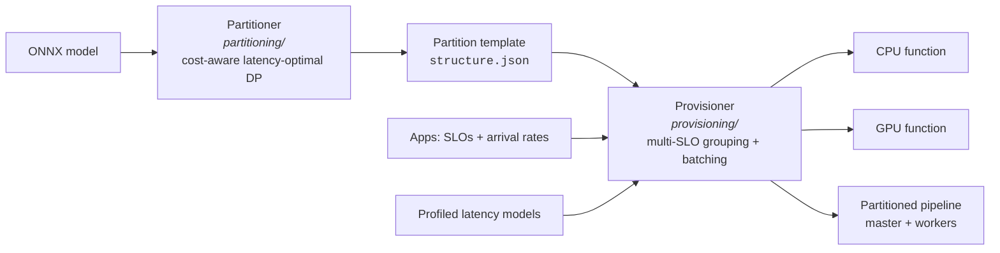
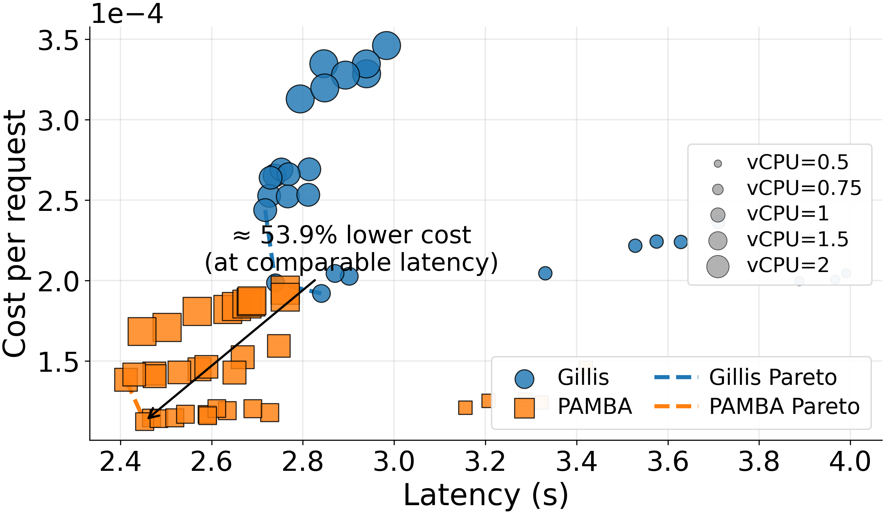
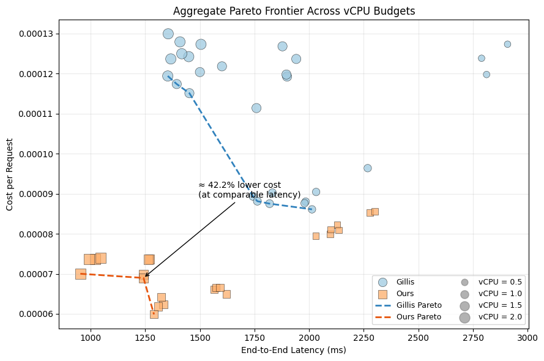
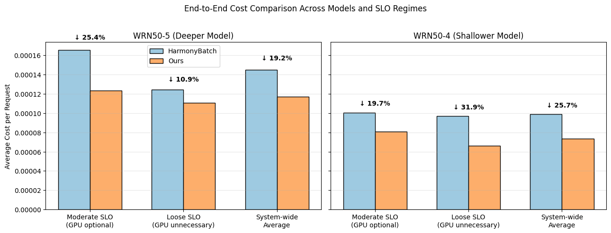
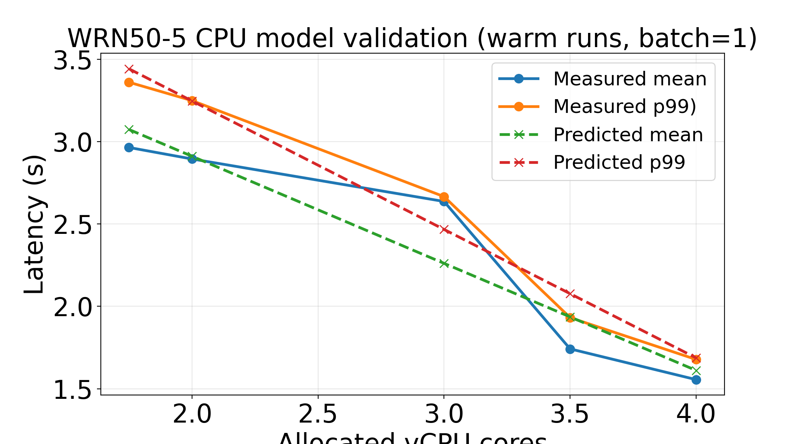
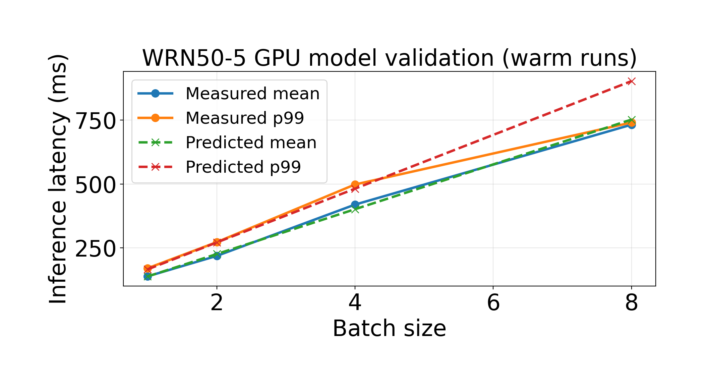
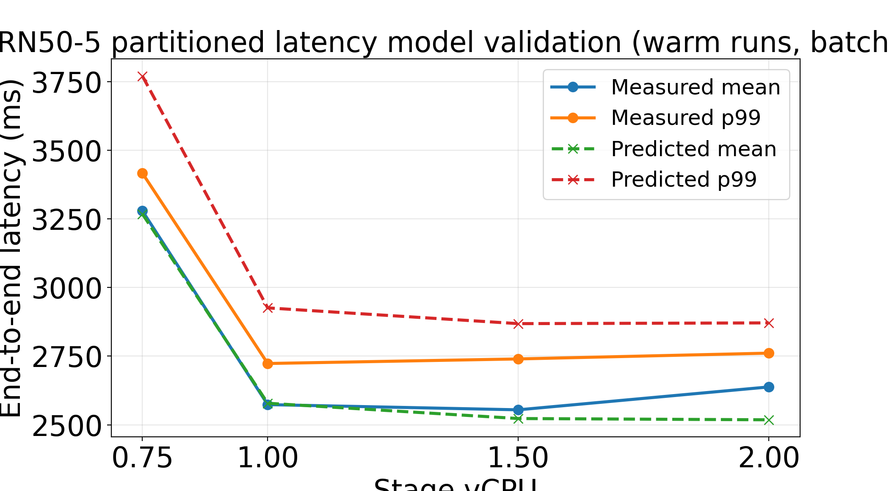

<div align="center">

# MPHB — Multi-SLO Partition-Aware Batching for Serverless Inference

**Cost-efficient DNN inference on serverless platforms: jointly optimizing execution mode, batching, and resource allocation across CPU, GPU, and partitioned multi-function pipelines.**

[](LICENSE)
[](provisioning/requirements.txt)
[](#deploying-on-serverless-platforms)
[](partitioning/README.md)

</div>

---

Serving DNN inference on serverless platforms forces a coarse choice: **CPU functions** are cheap but miss tight latency SLOs, while **GPU functions** are fast but billed in coarse units that low-rate workloads cannot amortize. MPHB bridges this gap with **partitioned execution** — the model is split into stages served by cooperating serverless functions — and integrates all three execution modes into a single multi-application, multi-SLO batching and provisioning optimizer backed by analytical latency and cost models.

Given a set of applications sharing a model, each with its own latency SLO and arrival rate, MPHB decides:

- 🧩 **How to group** applications so they can share functions and batches
- 📦 **How to batch** requests within each group (arrival-aware, CTMC-based batch distribution)
- ⚙️ **Which execution mode** to serve each group with — monolithic CPU, GPU, or a partitioned CPU pipeline
- 💰 **Which resources** (vCPU, GPU memory, per-stage sizing) minimize cost while meeting every SLO

## How it works



1. **Partition** — the partitioner (built on [Gillis](https://github.com/MincYu/gillis-open-source)) takes an ONNX model and computes a partition template with the best speedup-per-cost ratio, exporting per-stage model artifacts and `structure.json`.
2. **Model** — stage boundaries and profiled per-stage latency coefficients populate `provisioning/conf/config2.json`.
3. **Provision** — the provisioner (built on [HarmonyBatch](https://github.com/icloud-ecnu/HarmonyBatch)) searches CPU, GPU, and partitioned configurations and emits the cheapest plan that satisfies every application's SLO.

## Repository layout

| Directory | What it is |
|---|---|
| [`provisioning/`](provisioning/) | Main framework: grouping/provisioning algorithms, latency & cost models, profilers, experiment drivers (extends HarmonyBatch) |
| [`partitioning/`](partitioning/) | Model partitioner: cost-aware latency-optimal partitioning, ONNX/MXNet export, AWS Lambda deployment tooling (extends Gillis) |
| [`docs/results/`](docs/results/) | Selected evaluation figures |

## Quick start

### Provisioning plan in one minute

```bash
cd provisioning
pip install -r requirements.txt
python3 main.py            # cost-optimal plan for the apps defined in main.py
python3 experiments.py     # trace-driven end-to-end experiment
```

```
Provisioning plan:
The configurations of the group 0 is:
cpu:            1.60
batch:          1
rps:            5
timeout:        0.0
cost:           4.350e-05
slo:            0.5
```

Model, algorithm, SLOs, and search ranges are configured in `provisioning/conf/config.json` — see [provisioning/README.md](provisioning/README.md).

### Partition a model

```bash
cd partitioning/partition
# place your ONNX model in models/
python main.py lo -n <model.onnx> -p true    # cost-aware latency-optimal partitioning
```

This writes `<model>_workspace/` with per-partition ONNX/MXNet artifacts and `input/structure.json` — see [partitioning/README.md](partitioning/README.md).

## Deploying on serverless platforms

- **AWS Lambda** — `partitioning/aws_lambda_deploy/` generates one Lambda function per partition from the template and assembles an AWS SAM application (`deploy.sh -j <workspace>` → `sam build` → `sam deploy --guided`).
- **Alibaba Cloud Function Compute** — package each stage as a custom-container function and roll out image updates with `provisioning/deploy_fc_from_registry.sh`; reconfigure resources on the fly with `provisioning/function_reconfiguration.py`.

Function handler code deployed in our evaluation is not included; the deploy tooling generates or updates functions from your own images and URLs.

## Results

Evaluated on Alibaba Cloud Function Compute with Wide-ResNet models (WRN50-4, WRN50-5) under heterogeneous multi-SLO workloads.

**Cost–latency frontier.** Partitioned execution creates a third frontier between CPU and GPU, winning at intermediate SLOs where single-function CPU falls short of the deadline and GPU is underutilized — while substantially reducing the peak memory any single function needs:

<p align="center">
  
  
</p>

**End-to-end cost.** Under multi-application, multi-SLO workloads, partition-aware provisioning lowers total serving cost versus batching-only provisioning, at equal SLO compliance:

<p align="center">
  
</p>

**Latency-model accuracy.** The analytical models closely track measured latencies in all three execution modes:

<p align="center">
  
  
  
</p>

## Acknowledgements

MPHB builds directly on two open-source research systems, both MIT-licensed:

- **[HarmonyBatch](https://github.com/icloud-ecnu/HarmonyBatch)** — Chen et al., *"HarmonyBatch: Batching multi-SLO DNN Inference with Heterogeneous Serverless Functions,"* IWQoS 2024. Basis of `provisioning/`.
- **[Gillis](https://github.com/MincYu/gillis-open-source)** — Yu et al., *"Gillis: Serving Large Neural Networks in Serverless Functions with Automatic Model Partitioning,"* ICDCS 2021. Basis of `partitioning/`.

All credit for the original designs goes to their authors. See [NOTICE.md](NOTICE.md) for a precise list of what was extended in each codebase.

## License

[MIT](LICENSE). Upstream HarmonyBatch and Gillis are also MIT-licensed.
