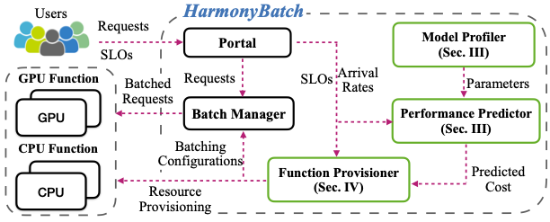

# Provisioning Framework

Cost-efficient resource provisioning for multi-SLO DNN inference on serverless platforms. Extends [HarmonyBatch](https://github.com/icloud-ecnu/HarmonyBatch) with **partitioned (multi-function pipeline) execution** as a third provisioning mode alongside CPU and GPU functions.



## Structure

```
harmony/
  algorithm/     Grouping and provisioning algorithms (Harmony, BATCH, MBS)
    harmony.py     Group merging across CPU / GPU / partitioned modes
    algorithm.py   Per-group provisioners for the three execution modes
  core/
    latency.py     CPULatency, GPULatency, and UnifiedLatency (partitioned pipeline model)
    cost.py        Cost models, incl. partitioned master+worker cost
    util.py        App/Apps/Cfg/Instance abstractions, batch distribution (CTMC)
  serverless/    Live-experiment plumbing: HTTP function clients, traces, profiler
conf/            Runtime configuration (see below)
```

Top-level scripts:

| Script | Purpose |
|---|---|
| `main.py` | Run the provisioning algorithm and print the optimal plan |
| `experiments.py`, `new_experiments.py` | Trace-driven simulation and live experiments |
| `profiler.py`, `CPU_e2eprofiler.py`, `GPU_e2eprofiler.py` | Profile deployed functions (single and partitioned) |
| `function_reconfiguration.py` | Update resources of deployed functions |
| `deploy_fc_from_registry.sh` | Roll out container images to Alibaba Cloud FC functions |
| `modelling_notebook.ipynb` | Fit latency-model coefficients from profiling data |

## Usage

```bash
pip install -r requirements.txt

# 1. Configure conf/config.json (model, algorithm, SLOs, resource ranges)
python3 main.py

# 2. Trace-driven experiments (traces in conf/app/)
python3 experiments.py
```

Example output of `main.py`:

```
Provisioning plan:
The configurations of the group 0 is:
cpu:            1.60
batch:          1
rps:            5
timeout:        0.0
cost:           4.350e-05
slo:            0.5
```

## Configuration

| File | Purpose |
|---|---|
| `conf/config.json` | Model name, algorithm (`Harmony` / `BATCH` / `MBS`), SLOs, `Res_CPU`/`Res_GPU` and `B_CPU`/`B_GPU` search ranges |
| `conf/model.json` | Per-model CPU/GPU latency coefficients obtained from profiling |
| `conf/config2.json` | Partitioned pipeline definition: stage boundaries (from `../partitioning`) and per-stage latency coefficients |
| `conf/app/appN.csv` | Request arrival trace for application N |

## Live deployment (Alibaba Cloud Function Compute)

For live function invocation (as opposed to trace-driven simulation):

1. Package the model server (single function) and each pipeline stage (master + workers) as custom-container images and push them to your container registry.
2. Fill in your registry and image→function mapping in `deploy_fc_from_registry.sh` and run it to update the FC functions.
3. Set your function URLs in the experiment scripts, your Alibaba Cloud `access_key_id`/`access_key_secret` in `conf/config.json`, and your account endpoint in `harmony/serverless/request.py`.

The function handler code itself is not part of this repository. **Never commit real credentials.**
